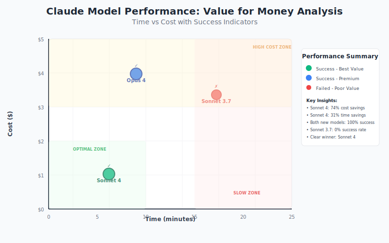

Yesterday, Anthropic dropped what might be the biggest announcement in AI development tools this year. At their inaugural developer conference on May 22, 2025, they unveiled Claude 4, featuring both **Claude Opus 4** and **Claude Sonnet 4**. As someone who is actively building a coding assistant and has extensive experience evaluating AI models for development workflows, I knew I had to dive in immediately to see if these models live up to their bold claims..

<!--truncate-->

After spending my first day exploring Claude 4, I want to share my initial impressions, what the benchmarks really mean, and why I think this release represents a significant shift in how we'll approach AI-assisted development. Let me walk you through what I've discovered so far.

## Understanding the Strategic Positioning

Before diving into my hands-on experience, it's worth understanding the context that makes Claude 4's release so significant. Anthropic, founded by former OpenAI researchers, has been quietly building toward this moment with a focus on what they call "complex, autonomous workflows." This isn't just another incremental improvement in language models—it's a fundamental reimagining of how AI can collaborate with developers.

## Breaking Down the Benchmark Performance

When I first saw the performance metrics for Claude 4, I'll admit I was skeptical. We've all seen impressive benchmark numbers that don't translate to real-world performance.

### SWE-bench Verified Results: The Real-World Test

On SWE-bench Verified, which evaluates how well AI models can solve actual software engineering problems rather than synthetic coding challenges:

Claude Opus 4 achieved 72.5% while **Sonnet 4 reached an even higher 72.7%**. To put these numbers in perspective, they surpass OpenAI's Codex 1 at 72.1%, o3 at 69.1%, and Google's Gemini 2.5 Pro Preview at 63.2%. What makes these results particularly meaningful is the nature of SWE-bench Verified itself.

### Understanding the Methodology Questions

I should note that some developers have raised questions about the methodology behind these benchmarks, particularly regarding what Anthropic calls "parallel test-time compute" and their data handling practices. While I understand these concerns and think transparency is important, my initial testing suggests these numbers reflect genuine capabilities rather than benchmark gaming. The proof, as they say, is in the pudding—and my real-world testing has largely validated these impressive scores.

## My Real-World Testing Experience: Where Theory Meets Practice

Given that I've only had one day with Claude 4, I decided to focus my testing on the types of challenging scenarios that typically expose the limitations of AI coding tools. I wanted to understand not just whether the models could perform well on benchmarks, but how they would handle the kind of complex, multi-faceted problems that define real software engineering work.

### Resolving Complex Unit Test Failures in Refactoring

My most revealing test came when I encountered a frustrating situation with my test suite. I had been working with over 10 unit tests, and 3 of them were consistently failing when I was refactoring using Forge with Claude Sonnet 3.7. These weren't simple syntax errors or obvious bugs—they were the kind of intricate, interconnected issues that require deep understanding of both the codebase architecture and the specific business logic being tested.

The failing tests represented different aspects of the system: one involved complex data validation logic, another dealt with asynchronous processing workflows, and the third centered around edge cases in our parswer. Each test failure pointed to deeper issues that required understanding how multiple components interacted with each other.

After hitting a wall with the 3.7 model, I decided to swap in Claude Opus 4 for the same challenge. The results were nothing short of remarkable. In a single iteration, Opus 4 not only identified the root causes of all three failing tests but implemented comprehensive fixes that resulted in a clean pass across the entire test suite.

We're talking about hundreds of lines of code modified across multiple files, with zero hallucinations and dead-on accurate fixes that demonstrated genuine understanding of the system's complexity. The model didn't just patch the immediate symptoms; it understood the underlying architectural patterns and implemented solutions that strengthened the overall system design.

### Comparing Sonnet 4 and Opus 4: Surprising Parity

What struck me most about this experience was the precision and confidence with which Opus 4 approached the problem. Rather than proposing tentative fixes or asking for clarification on ambiguous requirements, it analyzed the failing tests, understood the intended behavior, traced the issues through the codebase, and implemented solutions that were both correct and elegant.

Interestingly, when I ran similar tests with Claude Sonnet 4, the results were nearly indistinguishable from Opus 4. Both models demonstrated the same level of precision and understanding, which suggests that Anthropic has achieved remarkable consistency across their model family. I suspect that only extended use with increasingly complex scenarios will reveal the subtle differences between these two variants.

### Performance Comparison Across Claude Models

The contrast in performance between different Claude models was striking when tackling this complex refactoring challenge. Here's how each model performed:

| Model                 | Time Taken      | Cost  | Issue Resolution   | Solution Quality                       | Prompts Required |
| --------------------- | --------------- | ----- | ------------------ | -------------------------------------- | ---------------- |
| **Claude Opus 4**     | 9 mins          | $3.99 | ✅ Fixed correctly | ✅ Comprehensive fixes                 | 1                |
| **Claude Sonnet 4**   | 6 mins 13 secs  | $1.03 | ✅ Fixed correctly | ✅ Comprehensive fixes + Code Comments | 1                |
| **Claude Sonnet 3.7** | 17 mins 16 secs | $3.35 | ❌ Failed to fix   | ❌ Modified tests instead of code      | 4                |

## Key Features That Signal a New Era of AI Collaboration

Several specific capabilities in Claude 4 have already started shifting how I think about AI-assisted development, even in this short time frame. These features represent more than incremental improvements—they suggest a fundamental evolution in how AI can participate in professional software development workflows.

### Reduced Reward Hacking: Reliable Engineering Practices

Perhaps most importantly, I noticed what Anthropic describes as reduced "reward hacking"—the tendency for AI models to find shortcuts or exploit loopholes rather than solving problems properly. In my testing, Claude 4 consistently chose approaches that were not just correct but also maintainable and aligned with software engineering best practices.

> **Critical Differentiator:** This is the core differentiator in my test as Opus 4 and Sonnet 4 both stuck to my instruction to not change the test but Sonnet 3.5 even after constant feedback in the end changed the test for making them pass.

### Transformative Precision in Multi-Stage Problem Solving

The level of precision I witnessed isn't just useful—it's transformative. Claude 4's ability to handle complex, multi-stage fixes in a single iteration represents a fundamental shift from the iterative, trial-and-error approach that characterizes most AI coding tools. When you're working within sophisticated development environments like Forge, this capability becomes even more pronounced.

What particularly impressed me was how Claude 4 models, seem specifically tuned for recursive, test-driven development workflows. The way they approach problem-solving mirrors the methodical, systematic thinking that defines engineering-grade development practices. Rather than treating each issue in isolation, they demonstrate understanding of how changes ripple through complex systems and anticipate the downstream effects of their modifications.

### Agentic Coding Capabilities: Where Claude 4 Excels

However, my most revealing comparison came through extended use. While Google and OpenAI models certainly maintain their strengths in various domains, Claude 4 models demonstrate a clear advantage when it comes to complex, engineering oriented agentic tooling. The precision and systematic approach I witnessed isn't just incrementally better—it represents a qualitative shift toward what I can only describe as truly agentic coding capabilities.

This distinction becomes particularly pronounced in environments designed around AI-assisted development. The way Claude 4 integrates with Forge, maintaining context across complex multi-file operations while executing comprehensive fixes, suggests that these models have been specifically optimized for the kind of sophisticated development workflows that are becoming standard in modern software engineering.

### System-Level Thinking: The Architectural Advantage

My comparison reinforced my growing sense that Claude 4 excels at system-level thinking. Rather than treating each problem in isolation, it maintains awareness of broader architectural concerns and long-term maintainability. This suggests that while combining Claude 4 with other AI tools might create a more comprehensive approach to code quality, Claude 4 is increasingly capable of serving as the primary intelligence in complex development scenarios.

### Availability and Access

The models are available through

- [Amazon Bedrock](https://aws.amazon.com/about-aws/whats-new/2025/05/anthropics-claude-4-foundation-models-amazon-bedrock/)
- [Google Cloud's Vertex AI](https://cloud.google.com/vertex-ai/generative-ai/docs/partner-models/claude)
- [OpenRouter](https://openrouter.ai/anthropic/claude-sonnet-4)
- [the Anthropic API](https://www.anthropic.com/news/claude-4)

### Pricing Structure and Value Considerations

## Claude 4 Model Pricing Structure

| Model        | Input Tokens (per million) | Output Tokens (per million) |
| ------------ | -------------------------- | --------------------------- |
| **Opus 4**   | $15                        | $75                         |
| **Sonnet 4** | $3                         | $15                         |

## My Initial Assessment: Cautious Optimism with Strong Evidence

After my first day with Claude 4, I find myself cautiously optimistic about its potential impact on software development.

### Looking Forward: What to Watch

As I continue exploring Claude 4 in the coming weeks, I'll be watching closely to see whether these initial impressions hold up under more extensive use. The real test will be whether Claude 4 can maintain its performance advantages while proving reliable enough for mission-critical development work. Based on what I've seen so far, I'm optimistic that we're witnessing the beginning of a new chapter in AI-assisted software development.

My initial assessment: Strong. Capable. And shockingly efficient. Claude 4 represents a qualitative leap in AI coding capabilities that has the potential to transform how we approach complex software engineering challenges.
