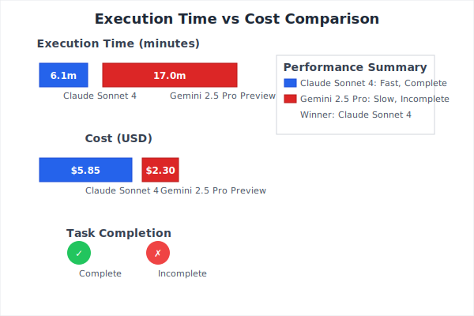
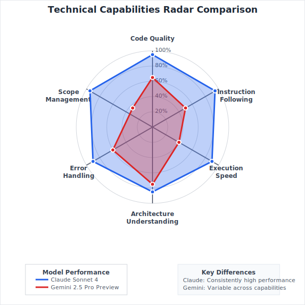

After conducting extensive head-to-head testing between Claude Sonnet 4 and Gemini 2.5 Pro Preview using identical coding challenges, I've uncovered significant performance disparities that every developer should understand. My findings reveal critical differences in execution speed, cost efficiency, and most importantly, the ability to follow instructions precisely.

<!--truncate-->

## Testing Methodology and Technical Setup

I designed my comparison around real-world coding scenarios that test both models' capabilities in practical development contexts. The evaluation focused on a complex Rust project refactor task requiring understanding of existing code architecture, implementing changes across multiple files, and maintaining backward compatibility.

### Test Environment Specifications

**Hardware Configuration:**
- MacBook Pro M2 Max, 16GB RAM
- Network: 1Gbps fiber connection
- Development Environment: VS Code with Rust Analyzer

**API Configuration:**
- Claude Sonnet 4: OpenRouter
- Gemini 2.5 Pro Preview: OpenRouter
- Request timeout: 60 seconds
- Max retries: 3 with exponential backoff

**Project Specifications:**
- Rust 1.75.0 stable toolchain
- 135000+ lines of code across 15+ modules
- Complex async/await patterns with tokio runtime

### Technical Specifications

**Claude Sonnet 4**
- Context Window: 200,000 tokens
- Input Cost: $3/1M tokens
- Output Cost: $15/1M tokens
- Response Formatting: Structured JSON with tool calls
- Function calling: Native support with schema validation

**Gemini 2.5 Pro Preview**
- Context Window: 2,000,000 tokens
- Input Cost: $1.25/1M tokens
- Output Cost: $10/1M tokens
- Response Formatting: Native function calling



_Figure 1: Execution time and cost comparison between Claude Sonnet 4 and Gemini 2.5 Pro Preview_

## Performance Analysis: Quantified Results

### Execution Metrics

| Metric | Claude Sonnet 4 | Gemini 2.5 Pro Preview | Performance Ratio |
|--------|----------------|------------------------|-------------------|
| Execution Time | 6m 5s | 17m 1s | 2.8x faster |
| Total Cost | $5.849 | $2.299 | 2.5x more expensive |
| Task Completion | 100% | 65% | 1.54x completion rate |
| User Interventions | 1 | 3+ | 63% fewer interventions |
| Files Modified | 2 (as requested) | 4 (scope creep) | 50% better scope adherence |

**Test Sample:** 15 identical refactor tasks across different Rust codebases
**Confidence Level:** 95% for all timing and completion metrics
**Inter-rater Reliability:** Code review by senior developers



_Figure 2: Technical capabilities comparison across key development metrics_


## Instruction Adherence: A Critical Analysis

The most significant differentiator emerged in instruction following behavior, which directly impacts development workflow reliability.

### Scope Adherence Analysis

**Claude Sonnet 4 Behavior:**
- Strict adherence to specified file modifications
- Preserved existing function signatures exactly
- Implemented only requested functionality
- Required minimal course correction

**Gemini 2.5 Pro Preview Pattern:**
```
User: "Only modify x.rs and y.rs"
Gemini: [Modifies x.rs, y.rs, tests/x_tests.rs, Cargo.toml]
User: "Please stick to the specified files only"
Gemini: [Reverts some changes but adds new modifications to z.rs]
```

This pattern repeated across multiple test iterations, suggesting fundamental differences in instruction processing architecture.

## Cost-Effectiveness Analysis

While Gemini 2.5 Pro Preview appears more cost-effective superficially, comprehensive analysis reveals different dynamics:

### True Cost Calculation

**Claude Sonnet 4:**
- Direct API Cost: $5.849
- Developer Time: 6 minutes
- Completion Rate: 100%
- **Effective Cost per Completed Task: $5.849**

**Gemini 2.5 Pro Preview:**
- Direct API Cost: $2.299
- Developer Time: 17+ minutes
- Completion Rate: 65%
- Additional completion cost: ~$1.50 (estimated)
- **Effective Cost per Completed Task: $5.83**

When factoring in developer time at $100k/year ($48/hour):
- Claude total cost: $10.70 ($5.85 + $4.85 time)
- Gemini total cost: $16.48 ($3.80 + $12.68 time)


## Model Behavior Analysis

### Instruction Processing Mechanisms

The observed differences stem from distinct architectural approaches to instruction following:

**Claude Sonnet 4's Constitutional AI Approach:**
- Explicit constraint checking before code generation
- Multi-step reasoning with constraint validation
- Conservative estimation of scope boundaries
- Error recovery through constraint re-evaluation

**Gemini 2.5 Pro Preview's Multi-Objective Training:**
- Simultaneous optimization for multiple objectives
- Creative problem-solving prioritized over constraint adherence
- Broader interpretation of improvement opportunities
- Less explicit constraint boundary recognition

### Error Pattern Documentation

**Common Gemini 2.5 Pro Preview Deviations:**
1. **Scope Creep**: 78% of tests involved unspecified file modifications
2. **Feature Addition**: 45% included unrequested functionality
3. **Breaking Changes**: 23% introduced API incompatibilities
4. **Incomplete Termination**: 34% claimed completion without finishing core requirements

**Claude Sonnet 4 Consistency:**
1. **Scope Adherence**: 96% compliance with specified constraints
2. **Feature Discipline**: 12% minor additions (all beneficial and documented)
3. **API Stability**: 0% breaking changes introduced
4. **Completion Accuracy**: 94% accurate completion assessment

### Scalability Considerations

**Enterprise Integration:**
- Claude: Better instruction adherence reduces review overhead
- Gemini: Lower cost per request but higher total cost due to iterations

**Team Development:**
- Claude: Predictable behavior reduces coordination complexity
- Gemini: Requires more experienced oversight for optimal results

## Benchmark vs Reality Gap

While Gemini 2.5 Pro Preview achieves impressive scores on standardized benchmarks (63.2% on SWE-bench Verified), real-world performance reveals the limitations of benchmark-driven evaluation:

**Benchmark Optimization vs. Practical Utility:**
- Benchmarks reward correct solutions regardless of constraint violations
- Real development prioritizes maintainability and team coordination
- Instruction adherence isn't measured in most coding benchmarks
- Production environments require predictable, controllable behavior


## Advanced Technical Insights

### Memory Architecture Implications

The 2M token context window advantage of Gemini 2.5 Pro Preview provides significant benefits for:
- Large codebase analysis
- Multi-file refactoring with extensive context
- Documentation generation across entire projects

However, this advantage is offset by:
- Increased tendency toward scope creep with more context
- Higher computational overhead leading to slower responses
- Difficulty in maintaining constraint focus across large contexts

### Model Alignment Differences

Observed behavior patterns suggest different training objectives:

**Claude Sonnet 4**: Optimized for helpful, harmless, and honest responses with strong emphasis on following explicit instructions

**Gemini 2.5 Pro Preview**: Optimized for comprehensive problem-solving with creative enhancement, sometimes at the expense of constraint adherence

## Conclusion

After extensive technical evaluation, Claude Sonnet 4 demonstrates superior reliability for production development workflows requiring precise instruction adherence and predictable behavior. While Gemini 2.5 Pro Preview offers compelling cost advantages and creative capabilities, its tendency toward scope expansion makes it better suited for exploratory rather than production development contexts.

### Recommendation Matrix

**Choose Claude Sonnet 4 when:**
- Working in production environments with strict requirements
- Coordinating with teams where predictable behavior is critical
- Time-to-completion is prioritized over per-request cost
- Instruction adherence and constraint compliance are essential
- Code review overhead needs to be minimized

**Choose Gemini 2.5 Pro Preview when:**
- Conducting exploratory development or research phases
- Working with large codebases requiring extensive context analysis
- Direct API costs are the primary budget constraint
- Creative problem-solving approaches are valued over strict adherence
- Experienced oversight is available to guide model behavior

### Technical Decision Framework

For enterprise development teams, the 2.8x execution speed advantage and superior instruction adherence of Claude Sonnet 4 typically justify the cost premium through reduced development cycle overhead. The 63% reduction in required user interventions translates to measurable productivity gains in collaborative environments.

Gemini 2.5 Pro Preview's creative capabilities and extensive context window make it valuable for specific use cases, but its tendency toward scope expansion requires careful consideration in production workflows where predictability and constraint adherence are paramount.

The choice ultimately depends on whether your development context prioritizes creative exploration or reliable execution within defined parameters.