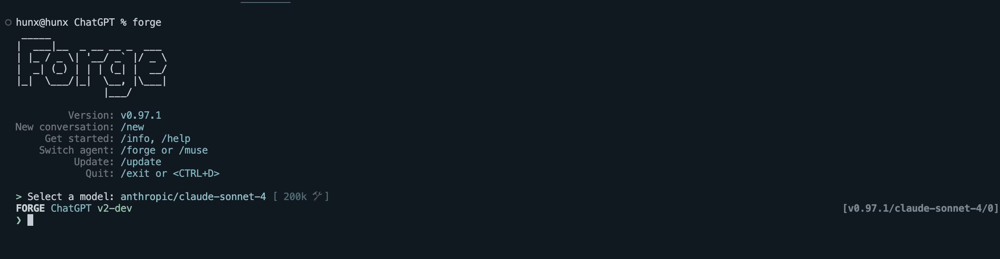
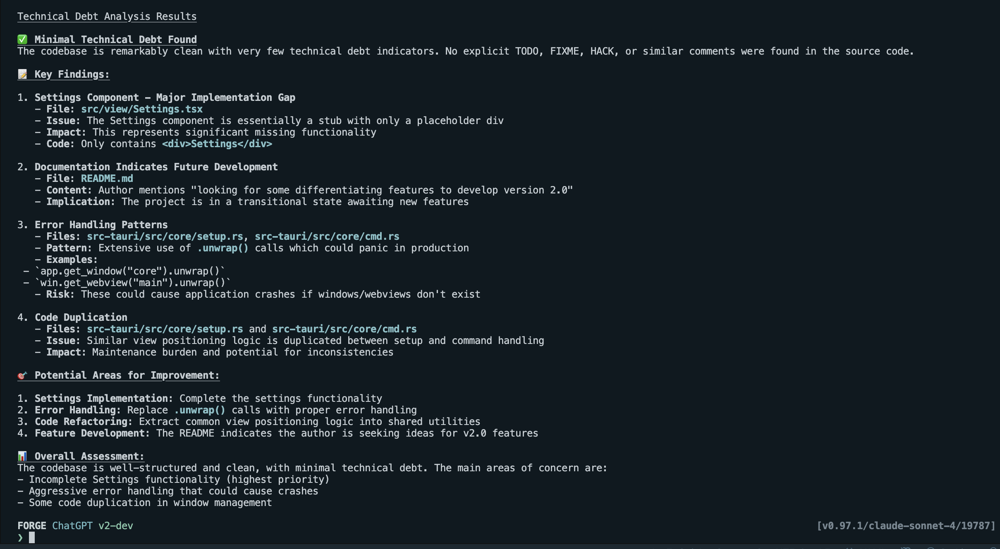
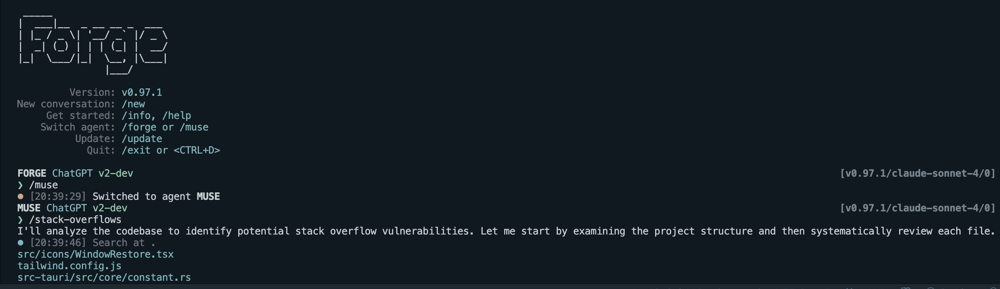
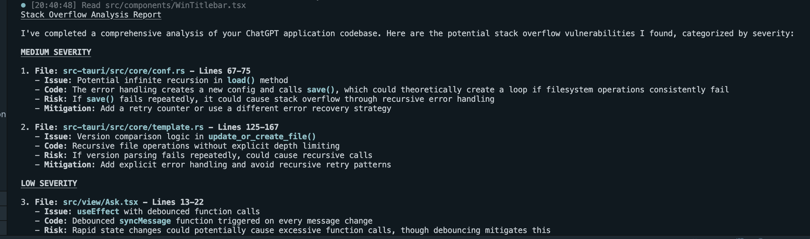
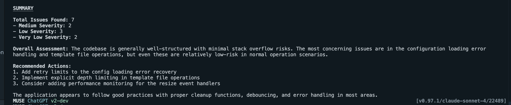
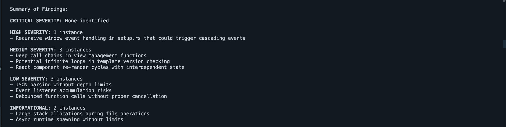
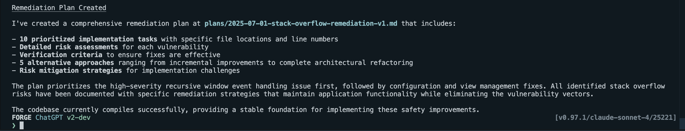
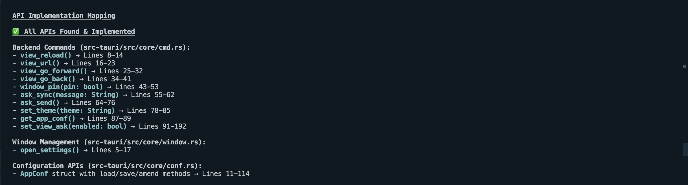

<!-- truncate -->

Say you are using Forge to plan out new features, fix bugs, write docs, and everything works fine. But what if you want to execute repeated tasks, like maybe analyze the code according to some guidelines or search for some particular pattern in the codebase? Sure, you can just guide the agent to do that, but won't it be time-consuming? What about onboarding? You'd have to also teach prompt-engineering to the team members just for them to be able to carry out repeated tasks. A better approach would be to use Forge's custom commands; they provide the flexibility you require and save your team a lot of time.

## Getting Started

I'm using [this](https://github.com/lencx/ChatGPT) Rust repository for the example. Let's open our code and run Forge to give it the full context of the codebase:



Now what we want to do in this example is to analyze the technical debt before committing so that we can maybe try to reduce it or plan how to deal with it. To create a basic custom command, open the newly created `forge.yaml` file. Add the `commands` property and create a new command:

```yaml
model: anthropic/claude-sonnet-4
commands:
  - name: tech-debt
```

give it a small, easy-to-type name.

```yaml
description: find all comments or code that contributes to tech-debt of the codebase
```

write a description so that you and other people know what this is about, and finally:

```yaml
prompt: go through each file, find comments that talk about adding a new feature or a todo, or anything that contributes to technical debt
```

write a clear, detailed prompt to carry out a task. Make sure you write a good prompt since this will be used repeatedly as the codebase grows with time.

This is how our `forge.yaml` looks like now:

```yaml
model: anthropic/claude-sonnet-4
commands:
  - name: tech-debt
    description: find all comments or code that contributes to tech-debt of the codebase
    prompt: go thorugh each file, find comments that talk about adding a new feature or a todo, or anything that contributes to technical debt
```

To run this command, just type `/tech-debt` in the Forge terminal, and you are good to go:



## Fixing Bad Code

One of the things we are commonly doing while reviewing code is look for bad code, which might lead to things like stack overflows, race conditions, or maybe dead code. Let's leave this to Forge's **Muse** agent, which is especially useful for tasks that require critical thinking and deep analysis of the codebase. Let's write a custom command to find code that may cause stack overflows to occur. First, switch to the Muse agent by typing `/muse`. Now add the command to `forge.yaml` as we did before:

```yaml
model: anthropic/claude-sonnet-4
commands:
  - name: stack-overflows
    description: find potential stack overflows in the code
    prompt: go through each file, find code that might cause stack overflows, list all instances along with thier severity.
```

Run `/stack-overflows` and voila! It lists all the places which need your attention!





This even recommends you which places to work on. If you add it to the prompt, it would even write detailed recommendations, but what if you want full control? Maybe you want to use a separate model for generating recommendations, ensure it follows your organization's code guidelines, or even change the temperature of the model? We thought of that, and that's why you can **make your own agents** and make them subscribe to a command's output. How cool is that!

Let's make an agent for recommending where exactly we need to make changes. In your `forge.yaml`, add a new property `agents` to it:

```yaml
agents:
  - id: stack-overflows-resolver
    model: google/gemini-2.5-pro
```

Give it an `id` and choose the model you want it to use.

```yaml
system_prompt: "{{> forge-system-prompt-engineer-plan.hbs }}"
```

Pass an hbs template or use our built-in templates, whichever is best for the job.

```yaml
subscribe:
  - stack-overflows
```

Make it subscribe to as many commands as you like so it will run whenever these commands are called.

```yaml
user_prompt: |
  <task>suggest how we can remove the risk of stack overflow from the following code chunks and make them safe, make a plan</task>
  <focus>{{event.value}}</focus>
```

Define a prompt that it will use along with the value of the commands it has subscribed to.

```yaml
tools:
  - forge_tool_fs_read
  - forge_tool_process_shell
```

Select the built-in tools that our agent would need to use, like read file-system and process the shell output.

```yaml
temperature: 0.2
```

Lower temperature is used for tasks that are highly consistent and deterministic, and with this, you are good to go! This is how our `forge.yaml` looks like:

```yaml
agents:
  - id: stack-overflows-resolver
    model: google/gemini-2.5-pro
    system_prompt: "{{> forge-system-prompt-engineer-plan.hbs }}"
    subscribe:
      - stack-overflows
    user_prompt: |
      <task>suggest how we can remove the risk of stack overflow from the following code chunks and make them safe, make a plan</task>
      <focus>{{event.value}}</focus>
    tools:
      - forge_tool_fs_read
      - forge_tool_process_shell
    temperature: 0.2
```

Now that we have our agent to make recommendations, we will change the custom command to not make any suggestions:

```yaml
prompt: go through each file, find code that might cause stack overflows, list all instances along with their severity, don't recommend any solutions.
```

When we run `/stack-overflows`, it will first list all the places which might cause a stack overflow, then our agent will generate the remediation plan for those places:




## Fixing Outdated Documentation

Let's have a look at another example: let's say you just implemented a feature in your app that introduces a breaking change, and you also need to update the docs to reflect the API changes. You have two options:

### Option A:

Manually go through the documentation, identify which references need to be updated, and then make the changes; will take time, energy, and be a total waste.

### Option B:

Make a custom command once, and that's it! Every time before committing, just run the command and let Forge handle the docs.

Of course, we'd go with Option B, and this time we'll use Forge's **Forge** agent that is used for writing code. First, do `/forge` to switch to the Forge agent, then let's add our command:

```yaml
commands:
  - name: outdated
    description: find API references that are outdated in the documentation
    prompt: go through the project documentation, link each API reference with its implementation in the codebase, and list which places need to be updated in the documentation
```

Just do `/outdated`, and it'll find all the places that need to be updated:



You can even go a step further and ask it to update the documentation.

## Final Thoughts

We demonstrated a few examples of how custom commands make your life a lot easier. You can use them to generate tests, remove hardcoded credentials before committing, raise PRs, and what not! Tell us in the comments how creative you got with custom commands and how you use it with Forge. See you next time with another blog.
