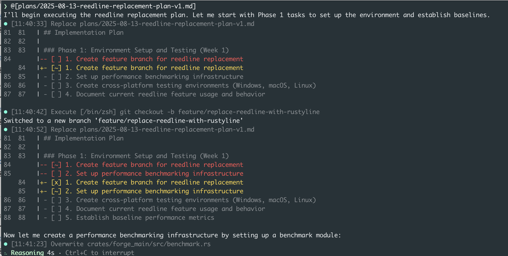

# What's New in Forge v0.106.0: Plan Progress Tracking and Improved Reliability

Version 0.106.0 introduces intelligent plan progress tracking and critical reliability improvements that make your development workflow smoother and more stable.

<!-- truncate -->

## Plan Progress Tracking

While Forge has always supported plan creation through the Muse agent, v0.106.0 adds real-time progress tracking. Forge now actively monitors and updates task status as it works through your plans.



### How It Works

Plans use checkbox syntax that Forge automatically manages:

- `[ ]` - Task not started
- `[~]` - Task in progress
- `[x]` - Task completed

When you reference a plan file, Forge works through tasks sequentially and updates their status in real-time. You can watch tasks move from `[ ]` to `[~]` to `[x]` as work progresses.

## Forge VS Code Extension

The new VS Code extension enables quick file reference copying in Forge's exact format, eliminating manual path and line number typing.

### Features

- **Copy File References**: Direct clipboard copying with line selections
- **Smart Format**: Automatic `@[<filepath>:<line start>:<line end>]` formatting
- **Quick Access**: `CTRL+U` keyboard shortcut
- **Requirements**: Forge in PATH, VS Code 1.102.0+

### Usage

1. Select code or lines
2. Press `CTRL+U`
3. Paste formatted reference into Forge

Install from the [VS Code Marketplace](https://marketplace.visualstudio.com/items?itemName=ForgeCode.forge-vscode).


## Bug Fixes and Improvements

### Fixed MCP Integration with OpenAI Models

Resolved critical MCP operation failures with OpenAI models caused by missing schema dependencies.

### Enhanced Retry Logic

Extended existing retry logic to handle empty response bodies. Previously, retry only worked for errors - now it also handles when AI providers return empty responses.

The system now retries for:

- Empty response bodies (new)
- Transport errors (existing)
- HTTP status codes: 429, 500, 502, 503, 504 (existing)

Configure retry behavior:

```bash
# .env
FORGE_RETRY_MAX_ATTEMPTS=3
FORGE_RETRY_INITIAL_BACKOFF_MS=1000
FORGE_RETRY_BACKOFF_FACTOR=2
FORGE_RETRY_STATUS_CODES=429,500,502,503,504
```

### Enhanced Error Messages

Replaced cryptic error messages with clear, actionable feedback that includes context and suggested next steps.

## How to Update

```bash
npx forgecode@latest
```

Or install globally:

```bash
npm install -g forgecode@latest
```

## Looking Ahead

Version 0.106.0 establishes the foundation for advanced project management and development tooling. The VS Code extension will expand with additional IDE integrations and enhanced code context features.

---

_Forge is open-source and community-driven. Join us at [github.com/antinomyhq/forge](https://github.com/antinomyhq/forge) to contribute or report issues._
