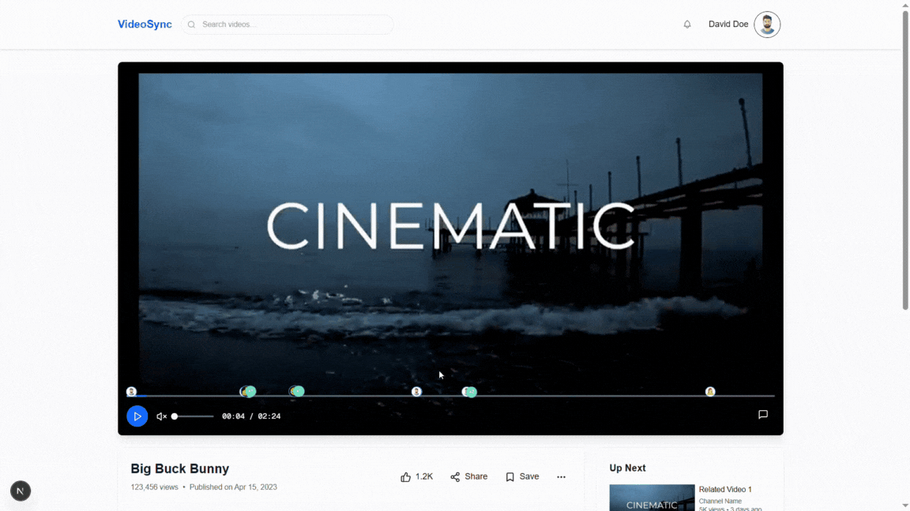
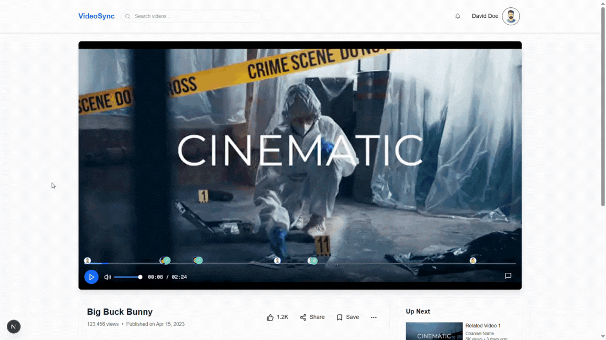
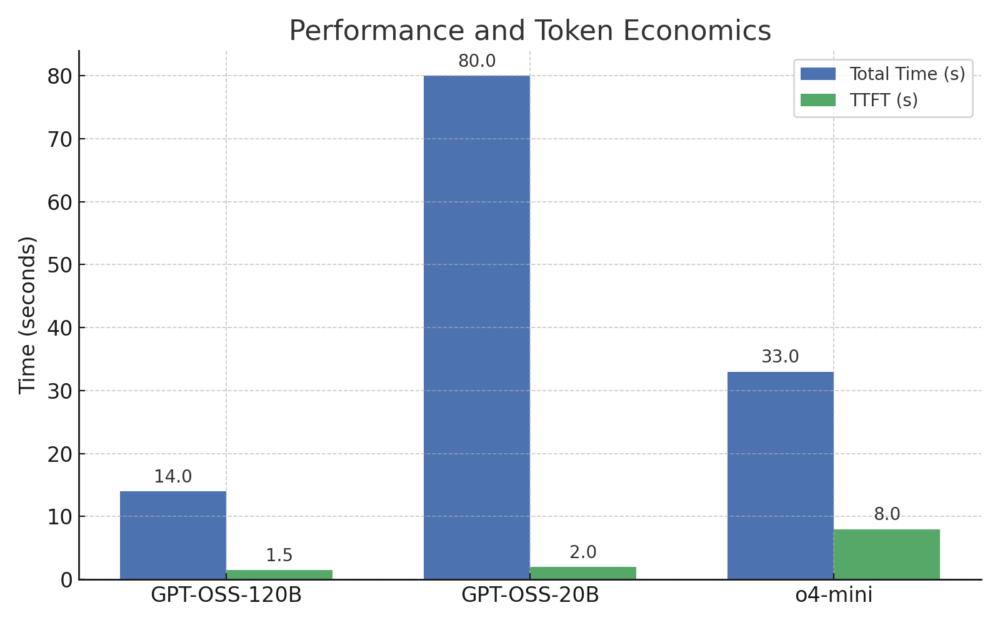
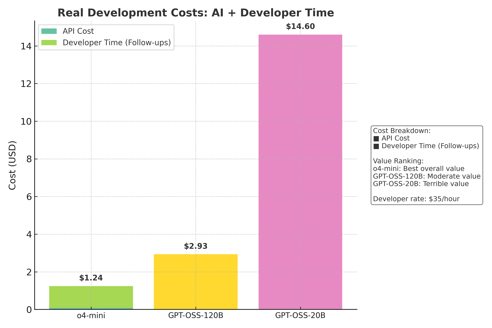
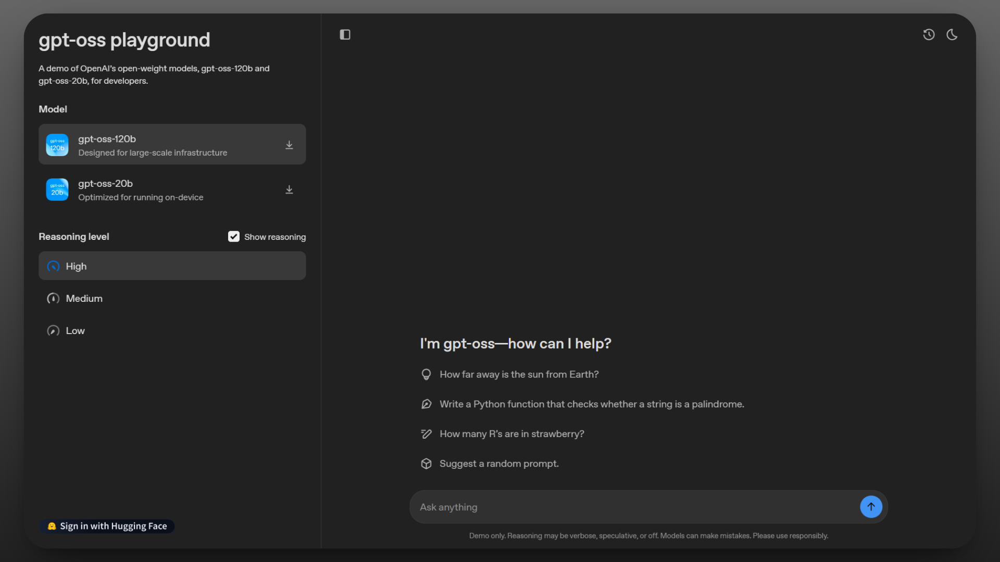

## TL;DR

I tested OpenAI's open-weight models (GPT-OSS-120B and 20B) against their closed o4-mini on complex video timeline implementation in Next.js to see which delivers working code with the least total cost.

**GPT-OSS-120B:** Lightning-fast 12-16 second completion with working code on first attempt. Needs basic error handling cleanup. At $0.0127 API cost plus 5 minutes debugging time, real total cost is $2.93.

**GPT-OSS-20B:** Quick initial responses but catastrophic failure requiring 6+ attempts over 80 seconds. Broke existing functionality completely. Total development cost reaches $14.60 when you include debugging marathon.

**o4-mini:** Slower 33-second completion but production-ready output with comprehensive error handling. At $0.0775 API cost plus just 2 minutes cleanup time, cheapest overall at $1.24 total cost.

<!--truncate-->

## **What is GPT-OSS?**

GPT-OSS shows OpenAI's move towards being more open about AI development. Unlike GPT-5 models, which are only accessible through APIs, GPT-OSS lets developers fully control the Open weights with the flexible Apache 2.0 license. This key difference allows developers to build, deploy, and customize AI applications in new ways.

### **Model Specifications**

Both variants use Mixture-of-Experts (MoE) to run efficiently despite their large parameter counts:

| Model | Total Parameters | Active Parameters | Memory Requirement | Best For |
| --- | --- | --- | --- | --- |
| **gpt-oss-20b** | 21 billion | 3.6 billion | 16GB RAM | Local development, consumer hardware |
| **gpt-oss-120b** | 117 billion | 5.1 billion | 80GB (single H100) | Production coding, enterprise use |
|  |  |  |  |  |

**How Mixture of Experts works:** Instead of activating all parameters, it selectively engages specialized experts. Coding tasks activate programming specialists, math problems engage different experts. You get large model capabilities with manageable resource usage.

Now let's see how these models perform on real development work.

## **The Test**

I tested these models on building YouTube-style timeline scrubbing for a video player. When you hover over the timeline, it should show thumbnail previews of that exact moment in the video.

This requires DOM events, canvas rendering, precise timestamp calculation, and smooth animations without breaking existing video controls. The kind of feature you'd actually ship to users.

**What I'm Looking For**

- Does it work on the first try?
- How much cleanup time do I need?
- Is the code production-ready or full of console.log statements?

This is the current video player, no timeline previews yet:


**Prompt:**

> Implement "Video Timeline Scrubbing with Dynamic Thumbnail Previews" feature this video player that works like YouTube's timeline hover behavior. CRITICAL: Do not break existing video functionality and position thumbnails ABOVE the timeline only. When hovering over the timeline, show 160x90px thumbnail previews of that timestamp with time tooltips, smooth cursor following, 200ms fade animations, supporting both mouse and touch interactions. Handles precise timestamp mapping, manages edge cases (loading, seeking, different durations), includes viewport boundary handling, with proper error handling and comments
> 

If the model’s first try didn’t meet all the requirements or broke something that was already working, I followed up with extra prompts to fix it. Some models needed more follow-ups than others to finish the job.

## **Results in Brief**

| Metric | GPT-OSS-120B | GPT-OSS-20B | o4-mini | Notes |
| --- | --- | --- | --- | --- |
| **First Response Time** | 1-2s | 1-3s | 6-10s | 120B responded fastest with near-instant replies, 20B was slightly slower but still quick, while o4-mini took 3-5x longer to begin generating responses |
| **Total Completion Time** | 12-16s | 80+ seconds | 33s | 120B finished fastest with complete working code, o4-mini took longer but delivered quality results, while 20B was slowest despite requiring multiple failed attempts |
| **Single-Prompt Success** | Yes | No (6 prompts) | Yes | 120B and o4-mini both delivered working solutions on first try, but 20B failed repeatedly and needed 6 separate prompts to reach a broken implementation |
| **Code Quality** | 7/10 | 4/10 | 9/10 | o4-mini produced the highest quality code with robust error handling, 120B delivered solid working code with minor issues, while 20B struggled with basic implementation |
| **Feature Completeness** | Working | Broken code | Working | 120B and o4-mini both implemented fully functional video scrubbing features, but 20B's final implementation broke the timeline and failed to deliver working preview functionality |

GIFs from the runs:

**GPT-OSS-120B:**



**GPT-OSS-20B:**


**Compare with o4-mini:**



## **Performance and Token Economics**

For complex UI tasks with 9,000 - 15,000 tokens of context, the total response times observed are:

- **GPT-OSS-120B:** 12-16 seconds total, 1-2s TTFT (time to first token)
- **GPT-OSS-20B:** 80+ seconds total across multiple attempts, 1-3s TTFT
**Note:** 80+ seconds total across 6 failed attempts**,** 1-3s TTFT each time
- **o4-mini:** 33 seconds total, 6-10s TTFT with noticeable thinking delay
    
    
    

**Average Token Usage and Costs Per Task:**

| Metric | GPT-OSS-120B | GPT-OSS-20B | o4-mini | Notes |
| --- | --- | --- | --- | --- |
| **Avg tokens per request** | 11,670 | 16,523 | 15,661 | 20B highest due to multiple retry attempts |
| **Input tokens** | 11,152 | 14,435 | 9,334 | o4-mini most efficient input processing |
| **Output tokens** | 518 | 2,088 | 6,327 | 120B remarkably concise, o4-mini 12x more verbose |
| **Cost per task** | $0.0127 | $0.0137 | $0.0775 | 6x cost gap between OSS models and o4-mini |

**Note on token patterns:** GPT-OSS-120B processes moderate input and responds concisely. o4-mini reads efficiently but generates extensive output. GPT-OSS-20B burns tokens on failed attempts and verbose corrections.

**Code Quality Check:**

| **Quality Factor** | **GPT-OSS-120B** | **GPT-OSS-20B** | **o4-mini** | **Notes** |
| --- | --- | --- | --- | --- |
| **Production Readiness** | 8/10 | 4/10 | 9/10 | o4-mini best, 120B solid but needs polish, 20B not ready |
| **Modern JavaScript** | 7/10 | 6/10 | 9/10 | o4-mini leads, 120B decent practices, 20B basic syntax |
| **Error Handling** | 5/10 | 3/10 | 9/10 | o4-mini robust exceptions, 120B console logs, 20B minimal |
| **Integration Complexity** | 8/10 | 3/10 | 8/10 | 120B and o4-mini clean integration, 20B breaks existing code |

> o4-mini writes the cleanest production code but costs a premium for it. 120B delivers solid, workable code that needs minor polish. 20B produces amateur-level code that breaks existing functionality, avoid it for anything important.
> 

## **Real Development Costs**

Most comparisons stop at API costs, but that misses the bigger picture. When building actual features, your time matters more than the AI's price tag. Here's what these models actually cost when you include debugging and polish time.

Using a standard developer rate of $35/hour for follow-up work:



**What "follow-up time" actually means:** The minutes you spend after the AI responds, reading through incomplete code, figuring out what broke, writing clarification prompts, testing half-working features, and converting `console.log` statements into proper error handling.

| Model | API Cost | Debug/Polish Time | Developer Cost | **Real Total** | Value Ranking |
| --- | --- | --- | --- | --- | --- |
| **o4-mini** | $0.0775 | 2 minutes | $1.17 | **$1.24** | Best overall value |
| **GPT-OSS-120B** | $0.0127 | 5 minutes | $2.92 | **$2.93** | Moderate value |
| **GPT-OSS-20B** | $0.0137 | 25 minutes | $14.58 | **$14.60** | Terrible value |

**Takeaways:** GPT-OSS-120B looks 6x cheaper than o4-mini until you factor in the extra 3 minutes you'll spend cleaning up its output. GPT-OSS-20B appears "affordable" but becomes a $14+ disaster when you account for the debugging marathon it creates.

## **Model Performance Analysis**

**GPT-OSS-120B**

- **Strengths:** Completed implementation in 12-16 seconds, worked on first attempt, preserved existing functionality.
- **Weaknesses:** Basic error handling with console.log, thumbnail loading states need improvement, requires production polish.

**GPT-OSS-20B**

- **Strengths:** Quick 1-3 second initial response, attempted full feature implementation.
- **Weaknesses:** Required 6 separate prompts, broke timeline functionality, failed to deliver working video previews.

**o4-mini**

- **Strengths:** No loading delays for thumbnails, comprehensive error handling, production-ready output.
- **Weaknesses:** Slower 6-10 second startup, generates 12x more tokens, costs $0.0775 vs $0.0127.

## **Setup Options**

There are multiple options to use GPT-OSS models with your current workflow. The choice depends on your needs, technical expertise, and use case.

### **Browser Testing (Zero Setup)**

The simplest option is **GPT-OSS Playground**. Head to [gpt-oss.com](https://gpt-oss.com/), where you can test both models instantly in your browser.




### **Development-Ready Integration**

You can use terminal-based AI coding assistants to test GPT-OSS models directly in your development workflow. If you want to integrate GPT-OSS into your development, use ForgeCode, which provides production-grade access with model flexibility.

```bash
cd /path/to/your/project
npx forgecode@latest
```

For lightweight edits, pick GPT-OSS-20B. For reasoning over massive codebases, switch to 120B. No infrastructure management, no download waiting, ForgeCode handles the complexity while you focus on building.

### **Quick API Access**

If you want programmatic access, **Hugging Face** offers the smoothest next step. Both GPT-OSS models are available through their [Inference API](https://huggingface.co/openai/gpt-oss-120b).

You can start coding in minutes:

```markdown
pythonfrom transformers import pipeline
import torch

*# Load the model (automatically downloads)*
pipe = pipeline(
    "text-generation",
    model="openai/gpt-oss-120b",
    torch_dtype="auto",
    device_map="auto"
)

*# Start coding with AI assistance*
messages = [{"role": "user", "content": "Optimize this Python function..."}]
result = pipe(messages, max_new_tokens=512)
```

With Hugging Face, you do not need to do any local setup headaches, automatic model downloading, built-in chat templating that handles GPT-OSS's harmony format correctly, and scales from free experimentation to production usage.

## **Final Verdict**

When you include debugging time, o4-mini is the most cost-effective option at $1.24 total per task, not the most expensive.

**For production features:** o4-mini delivers working code with minimal cleanup at $1.24 total cost. The higher API fee saves you time - no console.log debugging, no broken functionality, no multiple attempts needed.

**For budget development:** GPT-OSS-120B at $2.93 total cost works if you can handle a few minutes of basic error handling cleanup. Fast responses and functional implementations make it decent for non-critical work.

**Avoid for important features:** GPT-OSS-20B costs $14.60 total despite the low $0.0137 API price. The debugging time required makes it the most expensive choice when you factor in your hourly rate.

API pricing alone misses the bigger picture. The "most expensive" AI option often costs less when you account for development time. GPT-OSS models offer ownership and customization benefits, but for getting features built efficiently, the closed model wins on total economics.

---

## Related posts

1. [Claude Sonnet 4 vs Kimi K2 vs Gemini 2.5 Pro](https://forgecode.dev/blog/kimi-k2-vs-sonnet-4-vs-gemini-2.5-pro/)
2. [Claude Opus 4 vs. Grok 4 Coding Comparison](https://forgecode.dev/blog/claude-4-opus-vs-grok-4-comparison-full)
3. [Claude Opus 4 vs. Gemini 2.5 Pro](https://forgecode.dev/blog/claude-sonnet-4-vs-gemini-2-5-pro-preview-coding-comparison)
