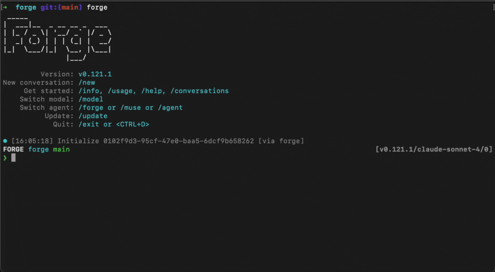

# Agent Selection Guide: Choose the Right AI Assistant for Your Task

## How to Switch Agents in Forge

Selecting the right agent for your workflow is simple:

1. **Open the agent selector** by typing `/agent` in your Forge session
2. **Browse available agents** from the list that appears
3. **Navigate with keyboard** - use up/down arrow keys to select
4. **Press Enter** to confirm and start working with your chosen agent



The interface displays all configured agents, including both default Forge agents and any custom agents you've added.

## Why Agent Selection Matters

Different agents are optimized for different types of work. While models determine the AI's underlying intelligence, agents define the behavior, personality, and specialized capabilities that shape how that intelligence is applied. Choosing the right agent means getting assistance tailored to your specific task, whether you're debugging, writing documentation, or architecting a new feature.

## Understanding Agent Types

### Built-in Forge Agents

Forge comes with specialized agents designed for different stages of development. Each has distinct capabilities and access levels:

**Forge Agent (Default):**

- Full read-write capabilities for implementing changes
- Modifies files, creates code, and executes commands
- Perfect for routine tasks and hands-off implementation
- Active by default when you start Forge

**Muse Agent:**

- Read-only mode for planning and analysis
- Creates detailed implementation plans without touching code
- Ideal for understanding scope before making changes
- Great for critical systems requiring careful review

**Sage Agent:**

- Read-only mode for deep research and investigation
- Traces functionality across multiple files
- Maps architecture, dependencies, and patterns
- Best for understanding how systems work before planning changes

Learn more: [Operating Agents Guide](/docs/operating-agents)

### Custom Agents

You can add your own agents with custom instructions and behaviors:

- **Team-specific workflows**: Agents configured for your codebase conventions
- **Domain expertise**: Agents specialized in specific frameworks or languages
- **Personal preferences**: Agents that match your communication style
- **Project requirements**: Agents tuned for particular project needs

Learn more: [Creating Custom Agents Guide](/docs/agent-definition-guide)

## When to Switch Agents

Different agents excel at different stages of development:

- **Sage** - Deep research and understanding complex systems
- **Muse** - Planning and analyzing changes before implementation
- **Forge** - Implementing solutions and making code changes
- **Custom Agents** - Specialized tasks or team-specific workflows

Use the `/agent` command to quickly switch between agents as your needs change.

For detailed guidance on when to use each built-in agent and switching strategies, see the [Operating Agents Guide](/docs/operating-agents).

## Pro Tips

:::tip Agent Context
Your conversation history and project context are maintained when switching agents, so you won't lose your place.
:::

:::tip Combine with Model Selection
Use `/model` and `/agent` together to fine-tune both the intelligence level and the behavioral approach for optimal results.
:::

Remember: The right agent can dramatically improve your productivity by understanding not just what you're building, but how you prefer to work. Don't hesitate to switch agents as your needs change throughout the day.

---

## Related Guides

- [Operating Agents Guide: Understanding Built-in Agents](/docs/operating-agents)
- [AI Model Selection Guide: Optimize Forge for Your Workflow](/docs/model-selection-guide)
- [Agent Definition Guide: Creating Custom Agents](/docs/agent-definition-guide)
- [Custom Rules Guide: Extending Forge's Capabilities](/docs/custom-rules-guide)
- [Plan and Act Guide: Automating Complex Workflows with Forge](/docs/plan-and-act-guide)

### Getting Help

If you're experiencing issues with forge:

1. **Export your session context:**

   ```bash
   /dump html
   ```

2. **Share with our team:**
   - **Discord**: [Join our Discord community](https://discord.gg/kRZBPpkgwq)
   - **Twitter/X**: Send us a DM [@forgecodehq](https://x.com/forgecodehq)
