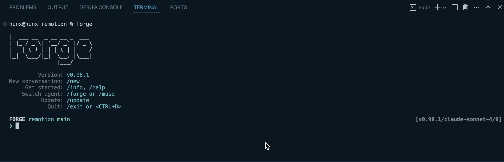

# Built-in Commands

*list all commands using the TAB key*

## Commands
Use these commands to interact with Forge and manage your workflow

| Command | Purpose | Information |
| --- | --- | --- |
| `/new `| start a new conversation, use when starting a new unrelated task. | switches the context for better responses. |
| `/info `| see important information like usage, environment and model. |  |
| `/model` | switch to a different model | Use `/model` to see available options. See model recommendations below. |
| `/agent` | display a list of all available agents, including custom agents, that you can switch to. | Agents are specialized AI assistants optimized for different tasks (coding, planning, etc.). Read more about [agents in Forge](../operating-agents). |
| `/forge` | switch to the built-in **Forge** agent, which is good for executing tasks. |  |
| `/muse` | switch to the built-in **Muse** agent, which is good for long planning sessions. |  |
| `/dump` | use as `/dump` or `/dump html` to save current conversation context to JSON or HTML format.  | requires existing conversation content to dump. |
| `/compact` | reduce conversation context by summarizing or removing older messages.  | useful when conversations become lengthy after handling multiple tasks. |
| `/help` | display all available commands and shortcuts. |  |
| `/tools` | display all the tools that can be used with agents. |  |
| `/update` | update Forge. |  |
| `/login` | login to Forge using browser. | login using the browser instead of setting the API key in the env variables. |
| `/logout` | logout of current forge session. | has no effect if API key is set in the env variables. |
| `/exit` | exit Forge terminal app. |  |

## Model Selection

Use the `/model` command to switch between different AI models based on your needs:

- **GPT-4.1** and **Claude's Sonnet** models for highly consistent results.
- **Qwen 235B** has a huge memory, ideal for advanced tasks.
- **OpenAI o4-mini** and **codex-mini** have the fastest response times.

## Related Documentation

- [Custom Commands](../custom-commands) - Create your own commands for specialized tasks
- [Context Compaction](../context-compaction) - Learn how to optimize context management
- [Agent Configuration](../agent-configuration) - Detailed reference for agent configuration options