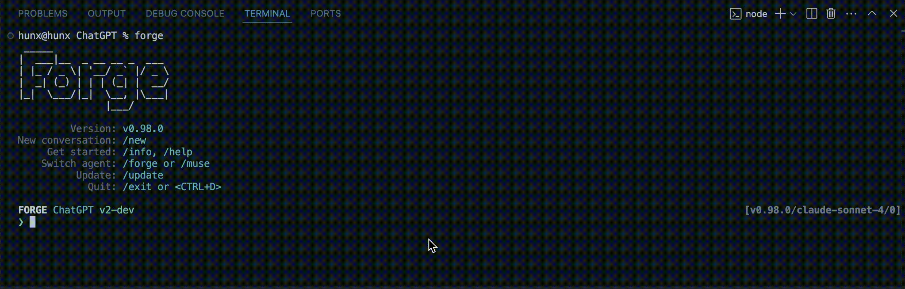
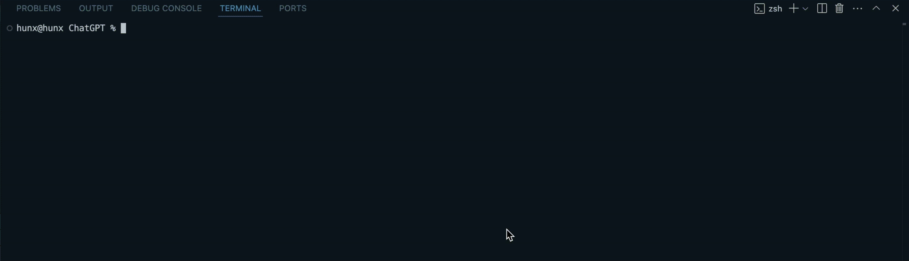
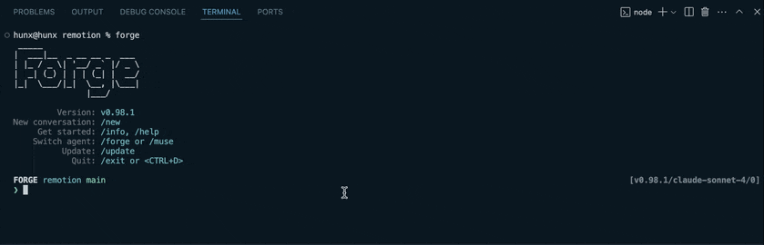

# custom commands

When using AI in development, teams often face the hassle of executing standard tasks, such as updating documentation or analyzing technical debt, which require detailed prompts each time. This repetitive process can be time-consuming and may lead to inconsistencies.

Forge’s custom commands solve that: they allow you to create **pre-configured shortcuts** in your codebase with prompts that include all the necessary instructions.



## Configuring Custom Commands

Custom commands are defined in the commands section of your forge.yaml file.

Let's examine each property in the commands section:

### name (required)

The name property defines the command identifier that users will type to execute the command. For example, if name is set to "outdated-docs", users will run it by typing `/outdated-docs` in Forge.

```yaml
commands:
  - name: outdated-docs
```

### description (required)

This provides a brief explanation of what the command does. This description appears in help menus and command listings to help users understand the purpose of each command.

```yaml
commands:
  - name: outdated-docs
    description: Find all the outdated documentation in the codebase
```

### prompt (optional)

The prompt value that will be used when the command is executed.

```yaml
commands:
  - name: outdated-docs
    description: Find all the outdated documentation in the codebase
    prompt: Scan through all documentation files and identify content that appears outdated, references deprecated features, or contains information that conflicts with current implementations.
```

You can also set a default value to allow users to pass their own argument:

```yaml
commands:
  - name: outdated-docs
    description: Find all the outdated documentation in the codebase
    ## users can pass their own prompt this way
    prompt: |
        Scan through all documentation files and identify content that appears outdated, references deprecated features, or contains information that conflicts with current implementations.
```

Start Forge:



Enter `/outdated-docs` to run the command:



## When not to use custom commands

Custom commands, if executed in a conversation, may cause the context to slowly deviate from the original version and focus on the tasks carried out by the commands. This might influence the responses for other unrelated tasks in the future. To reduce this deviation, avoid over-using the custom commands, start a new conversation or [raise an issue on GitHub](https://github.com/antinomyhq/forge/issues/new) if you would like it to have a different behavior.

## Best Practices

- Use **short** and **self-explanatory** names for commands, should not be too long to type.
- Write **helpful descriptions** that explain the purpose of the command effectively.
- **Document** your custom commands for the team and contributors.
- Provide **default values** for commands that can work without specific arguments.

## Related Features

- [Agent Configuration](../agent-configuration) - Learn about agent configuration options
- [Workflow Configuration](../workflow-config) - Learn about configuring workflows